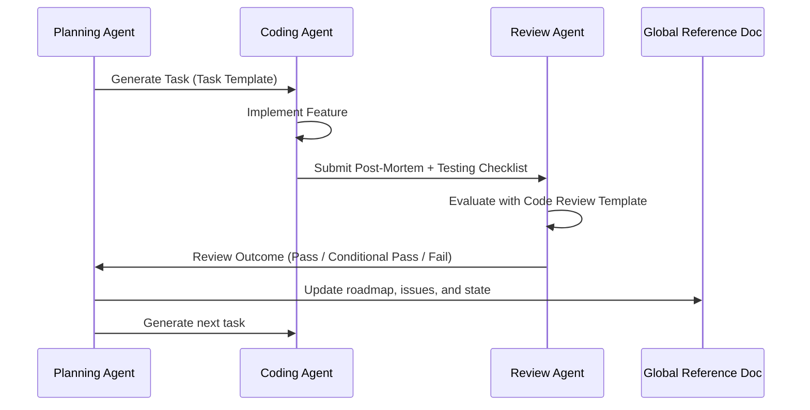

# Workflow Sequence Diagram

This diagram illustrates the workflow between Planning, Coding, Review, and Global Doc updates.

```mermaid
sequenceDiagram
    participant Planner as Planning Agent
    participant Coder as Coding Agent
    participant Reviewer as Review Agent
    participant GlobalDoc as Global Reference Doc

    Planner->>Coder: Generate Task (Task Template)
    Coder->>Coder: Implement Feature
    Coder->>Reviewer: Submit Post-Mortem + Testing Checklist
    Reviewer->>Reviewer: Evaluate with Code Review Template
    Reviewer->>Planner: Review Outcome (Pass / Conditional Pass / Fail)
    Planner->>GlobalDoc: Update roadmap, issues, and state
    Planner->>Coder: Generate next task
```
